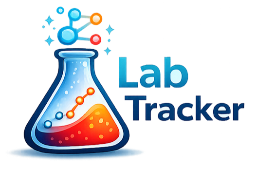

# LabTracker

  <picture>
    <source media="(prefers-color-scheme: dark)" srcset="./src/assets/labtracker-logo-dark.png" />
    
  </picture>

LabTracker is a privacy-first web app for men on TRT to turn messy lab PDFs into clear trends and actionable insights. Upload reports, validate extracted markers, compare latest vs previous labs, and run AI-assisted analysis in one dashboard.

Live app: [labtracker-dashboard.vercel.app](https://labtracker-dashboard.vercel.app)

## Features implemented

- Drag-and-drop PDF upload (`react-dropzone`)
- Adaptive PDF parser for mixed lab layouts (tables, line-based rows, multi-line rows)
- Smart OCR fallback for scanned PDFs (`tesseract.js`, client-side, only when needed)
- Claude structured extraction + AI lab analysis (full and latest-vs-previous)
- Editable extraction review table with hover edit icon
- Report context fields:
  - Protocol
  - Sampling timing
  - Supplements
  - Symptoms
  - Notes
- Dashboard charts (`recharts`):
  - Primary markers: Testosterone, Free Testosterone, Estradiol, Hematocrit, SHBG
  - All markers view
  - Reference range shading toggle
  - Abnormal highlight toggle
  - Annotation vertical lines toggle
  - Time range filter (3m/6m/12m/all/custom)
  - Unit conversion EU/US
  - Multi-marker comparison mode with dual axes
- Persistent storage in browser (`window.storage` fallback to `localStorage`)
- Data management:
  - Delete report
  - Bulk delete
  - Export CSV (selected markers)
  - Export PDF report screenshot (`html2canvas` + `jspdf`)
- Responsive UI + dark/light mode persistence
- Medical disclaimer

## Tech stack

- React 18
- TypeScript
- Vite
- Tailwind CSS
- Recharts
- react-dropzone
- date-fns
- pdfjs-dist
- framer-motion
